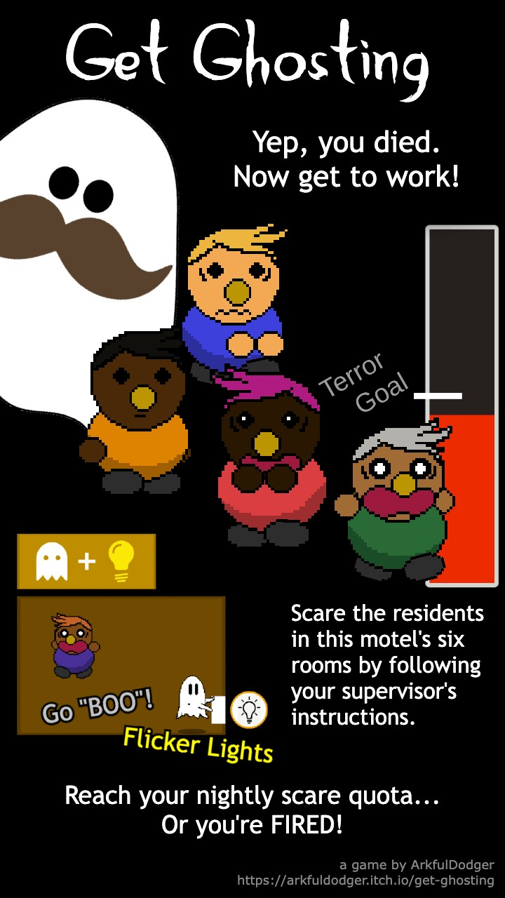

  

# Get Ghosting

It's your first night on the job, and this motel won't haunt itself!

Scramble to spook all your victims to your supervisor's instructions, or you're fired (unless you want another shot, because they're shortstaffed at the moment, and the economy...)

# About

This game was developed in Unity over a 48-hour period as a practice run prior to participating in the 2021 GMTK Game Jam. Was given the prompt: "Terror Above"

[You can play the game online on itch.io here.](https://arkfuldodger.itch.io/get-ghosting)

# Features
- Character positioning and movement automaically tied to and updates with mouse position
- Victim characters generate with hair, skin, and shirt colors which are all randomly selected within preset options
- The level difficulty is programmed in such a way as to incrementally increase infinitely until the player loses

# Credits

All programming, design, and art by me

Menu Song: "Funky Ghost (feat. Parry Gripp)" by JibJab

Game Music: "One Night In Las Vegas" by Lobo Loco 
